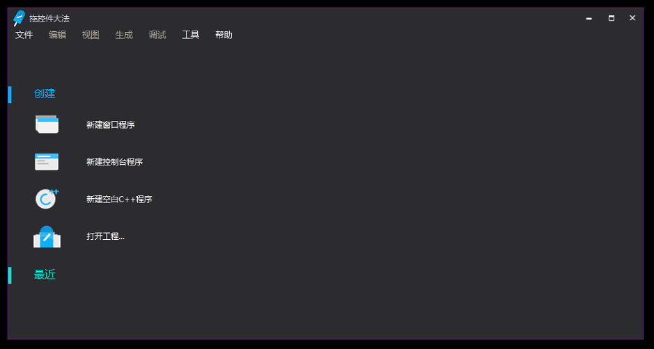
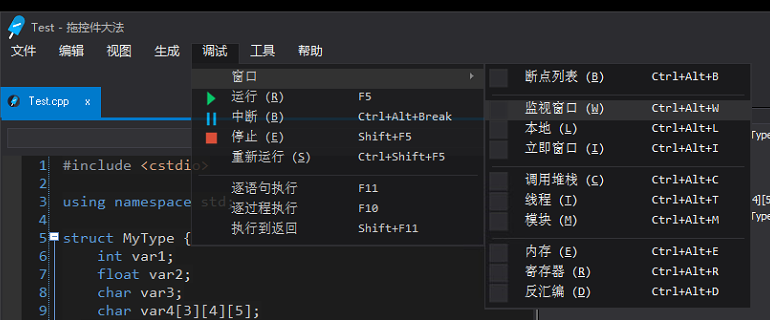
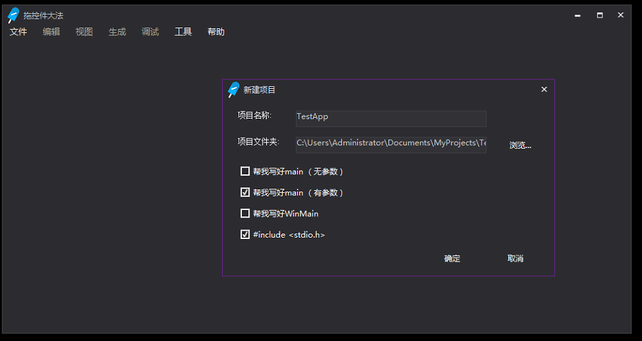
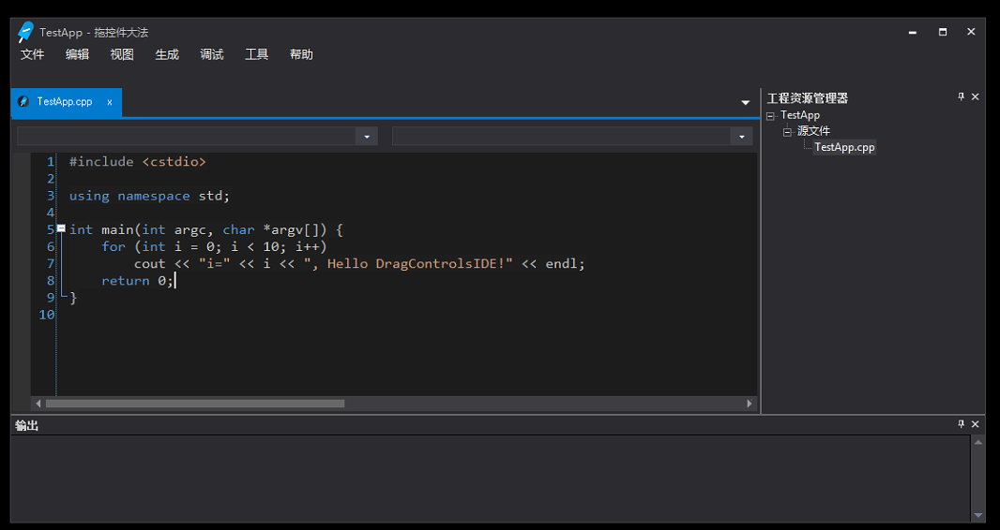
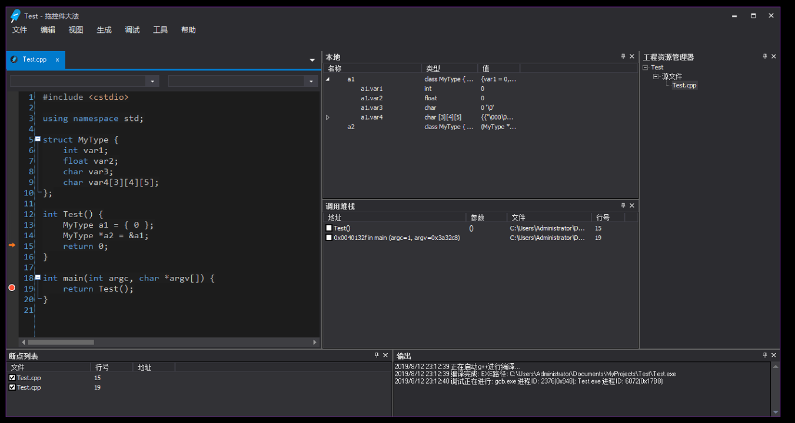

# DragControlsIDE-v2
拖控件大法第二版！第一版：https://github.com/SweetIceLolly/DragControlsIDE

第二版于2019年6月20日正式开坑！
预计完成时间... 一年？不知道哦 ╮(╯▽╰)╭

欢迎提出意见！感谢你们的支持！ ღ( ´･ᴗ･` )比心

[更新日志](CommitLog.md)

## 几点说明

1. 编译器和调试器都不是我写的！我只是负责调用g++、gdb，并分析它的输出罢了。如果您想看编译器或者调试器的代码，不好意思啦这里没有╮(╯_╰)╭

2. 这个程序的代码编辑框、DockingPane以及一部分的控件重绘（如滚动条）不是我写的，只是使用别人弄的ActiveX控件而已。（不过按钮、菜单、标题栏之类的UI是我写的）如果您想看代码框或者DockingPane实现的代码，抱歉啦我无能为力╮(╯_╰)╭

3. 本程序现在仍然处于开发，很多功能都尚不完善，或者根本还没开始编写。所以别急着说“xxx可以用了吗？”“为什么按下xxx没有反应”这样的话。不过对于目前（2019.8.12）已经编写了的功能（如本地窗口、调用堆栈窗口、断点等）欢迎提出issue。

4. 打开EXE的时候提示“xxx.ocx”未注册：请先注册目录下的.ocx文件：管理员权限运行`regsvr32 ocx路径`

5. 打开VBP后，VB6提示“找不到工程或库”：“工程”菜单 - 引用 - 浏览 - 选择工程目录下的“Win32Api.tlb” - 确定

6. 打开VBP后VB6可能会不允许你运行，说“没有许可证”之类的东西，那么你可能需要安装“Xtreme SuitePro ActiveX v15.3.1”。

7. 我不是在写另一个VS，我也不是在仿MFC/QT/C#，只是非常单纯的想弄一个方便C++制造小软件的工具，并且提供一些基础的调试功能而已。请不要拿这个小软件跟那些商业级的软件做比较。

## 一些截图（更新于2019.8.12）

 启动后的界面  

 菜单  

 “新建项目选项”对话框  

 代码编写界面  

 调试界面  
